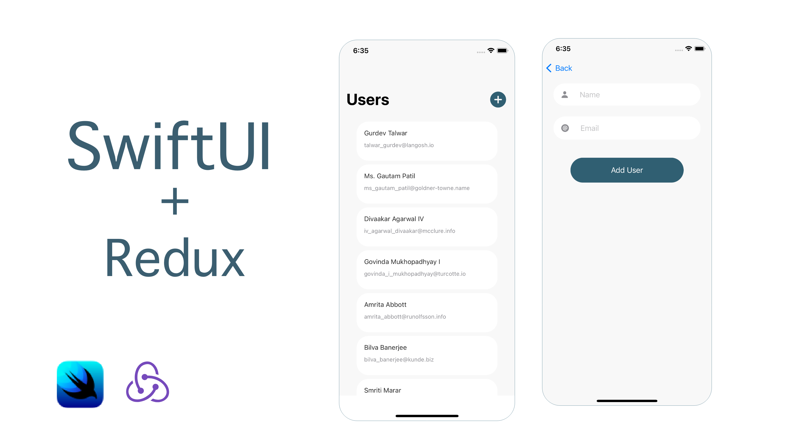
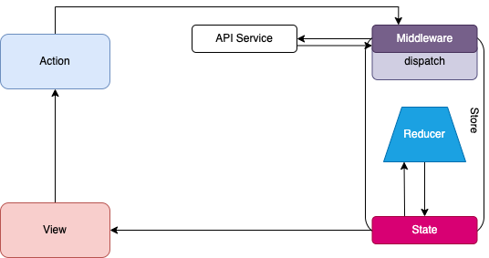

# UsersReduxDemo
Redux Demo in SwiftUI
## [ Redux Architecture - SwiftUI on YouTube](https://youtu.be/OB6B-2Tf_o4)
(https://youtu.be/OB6B-2Tf_o4)

## Architecture

## Views
Views have read-only access to the Application State and the only way to update the State is through a dispatcher, which we can call from the views.

## Actions 
Actions contain the data that we have to process to mutate the App State, and a reference to Reducer(which is a pure function) that will be used to perform the updates.

## Store
Store manages the State of every single object in the app.

## Dispatcher
Dispatcher manages all the data flow in the app, It receives an action and sends it to the Store for processing.

## Reducer
The function that returns the new state needs to be a pure function.
Pure functions are integral to how the state in Redux applications is updated. By definition, pure functions:
1. Return the same result if the same arguments are passed in
2. Depend solely on the arguments passed into them
3. Do not produce side effects, such as API requests and I/O operations

## Why Pure Functions Are Great
For our purposes, the most important feature of a pure function is that it's predictable. If we have a function that takes in our state and an action that occurred, the function should (if it's pure!) return the exact same result every single time.

## Middleware
Middleware will allow you to enhance your store by hooking into and intercepting actions before they reach any reducers.

## Author
- created by Hager Elsayed

## Credits
Users API consuming in this demo from [ this website ](https://gorest.co.in/)

